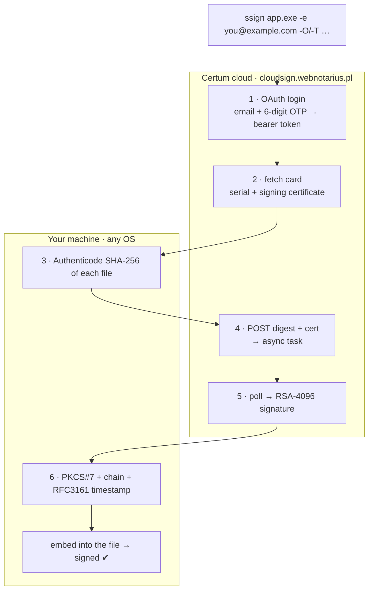

# ssign

**Sign Windows binaries with a Certum SimplySign cloud certificate — from one
command, on any OS.** · **Signez des binaires Windows avec un certificat cloud
Certum SimplySign — en une commande, sur n'importe quel OS.**

🇬🇧 **[English](#english)**  ·  🇫🇷 **[Français](#français)**

Authenticode signing is just data — hashing the file and wrapping the cloud's
RSA signature into a PKCS#7 blob. `ssign` does it all over plain HTTPS, so you
can sign a Windows binary from **Linux, macOS or Windows** — no GUI, no
SimplySign Desktop, no PKCS#11 stack, no container.



> Not affiliated with or endorsed by Certum / Asseco. "Certum" and "SimplySign"
> are their trademarks; `ssign` is an independent client for their public API.

---

## English

- [What it does — and doesn't](#what-it-does--and-doesnt)
- [Install](#install)
- [Usage](#usage)
- [⚠️ Security: the OTP is a long-lived secret](#️-security-the-otp-is-a-long-lived-secret)
- [GitHub Actions](#github-actions)
- [Secure signing with owner approval](#secure-signing-with-owner-approval)
- [Status](#status)
- [Sign any format — the PKCS#11 module](#sign-any-format--the-pkcs11-module)
- [Contributing — native formats wanted](#contributing--native-formats-wanted)
- [Acknowledgements](#acknowledgements)

> How the cloud protocol works: [`docs/simplysign-protocol.md`](docs/simplysign-protocol.md).

### What it does — and doesn't

| ✅ Does | ❌ Does not (yet) |
| --- | --- |
| Authenticode-sign **PE** files: `.exe`, `.dll`, `.sys`, `.ocx`, `.cpl` | **MSI / MSP / MSM** installers (work in progress) |
| Embed the **full certificate chain** (leaf + Certum intermediate) | **CAB**, catalog (`.cat`), PowerShell scripts, APPX/MSIX |
| Add an **RFC3161 timestamp** (`time.certum.pl`) | Sign with anything other than a **Certum SimplySign** cloud cert |
| Run on **Linux, macOS, Windows**; batch many files in **one login** | **Verify** signatures (use `signtool` / `osslsigncode`) |

### Install

```bash
cargo install ssign
# or grab a prebuilt binary from the Releases page (Linux / macOS / Windows)
```

### Usage

Two ways to authenticate — pick one:

| Mode | Flag | When |
| --- | --- | --- |
| **Automatic** | `-O, --otp <SEED>` | CI/scripts: give your TOTP **seed** once and `ssign` computes the 6-digit code every run. |
| **Manual** | `-T, --token <CODE>` | On your own machine: read the **current** code from your authenticator and pass it. |

Every flag also reads an environment variable, so nothing sensitive has to touch
your shell history or the process list.

```bash
# Manual, local — paste the current code from your app:
ssign -e you@example.com -T 123456 app.exe

# Automation — seed once, then hands-off:
export CERTUM_EMAIL=you@example.com
export CERTUM_OTP=YOUR_BASE32_TOTP_SEED       # or the full otpauth:// URI
ssign app.exe installer.dll driver.sys
```

Files are signed **in place** by default (`--backup` keeps a `.orig`; `-o <DIR>`
writes elsewhere). See `ssign --help` for every option.

### ⚠️ Security: the OTP is a long-lived secret

`-O/--otp` (env `CERTUM_OTP`) is your **TOTP seed** — the base32 secret behind
your authenticator. **It is long-lived**: anyone who has it *plus* your e-mail
can sign code **as you**, indefinitely, until you re-issue the SimplySign QR
code. **Treat it like a private key.**

- **Never** pass it as a command-line argument — it lands in your shell history
  and the process list. Use the environment variable.
- Prefer **`-T/--token`** (a one-shot 6-digit code) for local/manual signing, so
  the seed never leaves your authenticator app.
- In CI, store it as a **protected environment secret with required reviewers**
  (see [below](#secure-signing-with-owner-approval)) — not a plain repo secret.
- If it ever leaks, **rotate it**: re-issue the QR code from Certum.

The account **e-mail** is not sensitive, but the **seed** is. The 6-digit code
itself expires in ~30 s and is low-risk.

### GitHub Actions

```yaml
name: Sign

on:
  workflow_dispatch:        # manual only — each run performs a real cloud signature

jobs:
  sign:
    runs-on: ubuntu-latest
    environment: signing    # ← protected environment; see next section
    steps:
      - uses: actions/checkout@v4
      - run: cargo install ssign
      - run: ssign dist/*.exe
        env:
          CERTUM_EMAIL: ${{ secrets.CERTUM_EMAIL }}
          CERTUM_OTP:   ${{ secrets.CERTUM_OTP }}
      - uses: actions/upload-artifact@v4
        with: { name: signed, path: dist/ }
```

### Secure signing with owner approval

Signing can spend your certificate and, if mishandled, expose the OTP seed. Gate
it behind a **GitHub Environment** so **the repository owner must approve every
signing run** before the job can even read the secrets:

1. **Settings → Environments → New environment**, name it `signing`.
2. Add a **Deployment protection rule → Required reviewers**, and add yourself
   (the owner). Now any job that targets this environment **pauses for your
   approval**.
3. Store `CERTUM_EMAIL` and `CERTUM_OTP` as **environment secrets** of `signing`
   (not repository secrets). They become readable **only** inside an approved run
   of a job that declares `environment: signing`.
4. In the workflow, the signing job declares `environment: signing` (as above).

Result: a pull request — even a malicious one — **cannot** trigger a signature
or read the seed; every run waits for the owner's click. Also keep the signing
job on `workflow_dispatch` or protected-branch pushes, **never** on
`pull_request` from forks.

**In a release pipeline**, make signing a **job in the same workflow** as the
build/release (gated by `environment: signing`, with the release job set to
`needs:` it) — so a tag becomes *build → approve → signed release*. Don't rely on
a separate workflow triggered by `release: published`: a release created by the
built-in `GITHUB_TOKEN` **does not** trigger other workflows.

### Status

Working end to end for **PE** files, proven in CI: `ssign` produces a valid
Authenticode signature with the real Certum cloud certificate, the full chain,
and an RFC3161 timestamp. **MSI signing is in progress** and not yet enabled.

Pipeline: `otp` → `auth` (OAuth) → `card` → `sign` (SCS1_ATOM) → `authenticode`
(hash + PKCS#7) → `timestamp` (RFC3161).

### Sign any format — the PKCS#11 module

ssign's own signer covers **PE** (`.exe`/`.dll`/`.sys`/…). For **every** other
Authenticode format — MSI, CAB, catalog, APPX, PowerShell — ssign also ships a
**PKCS#11 module** (`ssign-pkcs11`) that hands your Certum cloud key to
[`osslsigncode`](https://github.com/mtrojnar/osslsigncode), which already knows
how to hash and package them all. Still no SimplySign Desktop, no p11-kit, no
smart card — the module talks to the cloud over HTTPS like the rest of ssign.

```sh
cargo build -p ssign-pkcs11 --release   # → target/release/libssign_pkcs11.so

export CERTUM_EMAIL=you@example.com CERTUM_OTP=BASE32SEED
osslsigncode sign \
  -pkcs11module ./target/release/libssign_pkcs11.so \
  -pkcs11cert 'pkcs11:type=cert' -key 'pkcs11:type=private' \
  -ac certum-code-signing-2021-ca.pem \
  -h sha256 -t http://time.certum.pl/ \
  -in installer.msi -out installer-signed.msi
```

It reads the same `CERTUM_EMAIL` / `CERTUM_OTP` (or `CERTUM_TOKEN`) as the CLI
and **caches the cloud session**, so signing many files in a row needs only one
code. `-ac` embeds the Certum "Code Signing 2021 CA" intermediate so the chain
verifies. `ssign-pkcs11/tests/sign-all-formats.sh` signs one file of each format
end to end.

### Contributing — native formats wanted

The module covers every format *today* via osslsigncode. Native, dependency-free
support in ssign itself (so you need neither osslsigncode nor a PKCS#11 engine)
is still welcome:

- **MSI / MSP / MSM** — in progress; the CFB (OLE2) pre-hash doesn't yet match
  `osslsigncode`. Notes or a fix here would be gold.
- **CAB** cabinet archives, **CAT** security catalogs, **APPX / MSIX** packages
- **PowerShell / script** signing (`.ps1`, `.psm1`, `.vbs`, `.js`) via SIP

Each is independent of the cloud plumbing — login, card and signing already work,
so the task is "hash this container format the Authenticode way, then hand the
digest to the existing sign path." Open an issue or a PR; happy to point you at
the relevant module.

### Acknowledgements

- **[hpvb/certum-container](https://github.com/hpvb/certum-container)** — its
  Docker + Xvnc + SimplySign + p11-kit setup, and especially the "you must press
  Close or the token won't work" note, are what made reverse-engineering the
  SimplySign cloud protocol tractable. ssign drops the container entirely, but it
  stood on that groundwork.
- **[osslsigncode](https://github.com/mtrojnar/osslsigncode)** — the reason the
  PKCS#11 module reaches every format: it hashes and packages PE, MSI, CAB, CAT,
  APPX and scripts, so ssign only has to supply the cloud key.

---

## Français

- [Ce qu'il fait — et ne fait pas](#ce-quil-fait--et-ne-fait-pas)
- [Installation](#installation)
- [Utilisation](#utilisation)
- [⚠️ Sécurité : l'OTP est un secret à longue durée](#️-sécurité--lotp-est-un-secret-à-longue-durée)
- [GitHub Actions (FR)](#github-actions-fr)
- [Signature sécurisée avec accord du propriétaire](#signature-sécurisée-avec-accord-du-propriétaire)
- [État](#état)
- [Signer tous les formats — le module PKCS#11](#signer-tous-les-formats--le-module-pkcs11)
- [Contribuer — formats natifs recherchés](#contribuer--formats-natifs-recherchés)
- [Remerciements](#remerciements)

La signature Authenticode, ce ne sont que des données : hacher le fichier et
emballer la signature RSA du cloud dans un blob PKCS#7. `ssign` fait tout en
HTTPS pur — donc on signe un binaire Windows depuis **Linux, macOS ou Windows**,
sans GUI, sans SimplySign Desktop, sans pile PKCS#11, sans conteneur. (Voir le
[schéma en haut](#ssign).)

### Ce qu'il fait — et ne fait pas

| ✅ Fait | ❌ Ne fait pas (encore) |
| --- | --- |
| Signe en Authenticode les **PE** : `.exe`, `.dll`, `.sys`, `.ocx`, `.cpl` | Les installeurs **MSI / MSP / MSM** (en cours) |
| Embarque la **chaîne complète** (feuille + intermédiaire Certum) | **CAB**, catalogues (`.cat`), scripts PowerShell, APPX/MSIX |
| Ajoute un **horodatage RFC3161** (`time.certum.pl`) | Signer avec autre chose qu'un cert cloud **Certum SimplySign** |
| Tourne sur **Linux, macOS, Windows** ; lot de fichiers en **un seul login** | **Vérifier** les signatures (utilisez `signtool` / `osslsigncode`) |

### Installation

```bash
cargo install ssign
# ou récupérez un binaire prêt à l'emploi depuis la page Releases (Linux / macOS / Windows)
```

### Utilisation

Deux façons de s'authentifier — au choix :

| Mode | Option | Quand |
| --- | --- | --- |
| **Automatique** | `-O, --otp <SEED>` | CI/scripts : fournissez votre **seed** TOTP une fois, `ssign` calcule le code à 6 chiffres à chaque exécution. |
| **Manuel** | `-T, --token <CODE>` | Sur votre machine : lisez le code **courant** de votre appli d'authentification et passez-le. |

Chaque option lit aussi une variable d'environnement — rien de sensible ne
touche votre historique shell ni la liste des processus.

```bash
# Manuel, en local — collez le code courant de votre appli :
ssign -e vous@example.com -T 123456 app.exe

# Automatisation — le seed une fois, puis sans intervention :
export CERTUM_EMAIL=vous@example.com
export CERTUM_OTP=VOTRE_SEED_TOTP_BASE32       # ou l'URI otpauth:// complète
ssign app.exe installeur.dll pilote.sys
```

Les fichiers sont signés **sur place** par défaut (`--backup` garde un `.orig` ;
`-o <DIR>` écrit ailleurs). Voir `ssign --help` pour toutes les options.

### ⚠️ Sécurité : l'OTP est un secret à longue durée

`-O/--otp` (env `CERTUM_OTP`), c'est votre **seed TOTP** — le secret base32
derrière votre authentificateur. **Il est à longue durée** : quiconque l'a *avec*
votre e-mail peut signer du code **en votre nom**, indéfiniment, jusqu'à ce que
vous régénériez le QR code SimplySign. **Traitez-le comme une clé privée.**

- **Jamais** en argument de ligne de commande — il finit dans l'historique shell
  et la liste des processus. Utilisez la variable d'environnement.
- Préférez **`-T/--token`** (un code à usage unique) pour le signage local, afin
  que le seed ne quitte jamais votre appli d'authentification.
- En CI, stockez-le comme **secret d'environnement protégé avec relecteurs
  requis** (voir [plus bas](#signature-sécurisée-avec-accord-du-propriétaire)) —
  pas un simple secret de dépôt.
- En cas de fuite, **régénérez-le** : refaites le QR code chez Certum.

L'**e-mail** du compte n'est pas sensible ; le **seed** l'est. Le code à 6
chiffres, lui, expire en ~30 s et présente peu de risque.

### GitHub Actions (FR)

```yaml
name: Sign

on:
  workflow_dispatch:        # manuel uniquement — chaque exécution signe réellement

jobs:
  sign:
    runs-on: ubuntu-latest
    environment: signing    # ← environnement protégé ; voir la section suivante
    steps:
      - uses: actions/checkout@v4
      - run: cargo install ssign
      - run: ssign dist/*.exe
        env:
          CERTUM_EMAIL: ${{ secrets.CERTUM_EMAIL }}
          CERTUM_OTP:   ${{ secrets.CERTUM_OTP }}
      - uses: actions/upload-artifact@v4
        with: { name: signed, path: dist/ }
```

### Signature sécurisée avec accord du propriétaire

Signer dépense votre certificat et, mal géré, peut exposer le seed OTP.
Verrouillez ça derrière un **Environment GitHub** pour que **le propriétaire du
dépôt approuve chaque signature** avant même que le job ne lise les secrets :

1. **Settings → Environments → New environment**, nommez-le `signing`.
2. Ajoutez une règle **Deployment protection rule → Required reviewers**, et
   ajoutez-vous (le propriétaire). Tout job visant cet environnement **se met en
   pause en attendant votre approbation**.
3. Stockez `CERTUM_EMAIL` et `CERTUM_OTP` comme **secrets d'environnement** de
   `signing` (pas des secrets de dépôt). Ils ne sont lisibles **que** dans une
   exécution approuvée d'un job déclarant `environment: signing`.
4. Dans le workflow, le job de signature déclare `environment: signing` (ci-dessus).

Résultat : une pull request — même malveillante — **ne peut pas** déclencher une
signature ni lire le seed ; chaque exécution attend le clic du propriétaire.
Gardez aussi le job de signature sur `workflow_dispatch` ou des pushes de
branches protégées, **jamais** sur `pull_request` depuis un fork.

**Dans un pipeline de release**, mettez la signature en **job du même workflow**
que le build/release (gardé par `environment: signing`, et le job release le
met en `needs:`) — un tag devient alors *build → approbation → release signée*.
Ne comptez pas sur un workflow séparé déclenché par `release: published` : une
Release créée par le `GITHUB_TOKEN` intégré **ne déclenche pas** d'autre workflow.

### État

Fonctionne de bout en bout pour les **PE**, prouvé en CI : `ssign` produit une
signature Authenticode valide avec le vrai certificat cloud Certum, la chaîne
complète et un horodatage RFC3161. **La signature MSI est en cours** et pas
encore activée.

Pipeline : `otp` → `auth` (OAuth) → `card` → `sign` (SCS1_ATOM) → `authenticode`
(hash + PKCS#7) → `timestamp` (RFC3161).

### Signer tous les formats — le module PKCS#11

Le signeur natif de ssign couvre les **PE** (`.exe`/`.dll`/`.sys`/…). Pour
**tous** les autres formats Authenticode — MSI, CAB, catalogue, APPX, PowerShell
— ssign fournit aussi un **module PKCS#11** (`ssign-pkcs11`) qui présente votre
clé cloud Certum à [`osslsigncode`](https://github.com/mtrojnar/osslsigncode),
qui sait déjà tous les hasher et les emballer. Toujours sans SimplySign Desktop,
sans p11-kit, sans carte à puce — le module parle au cloud en HTTPS comme le
reste de ssign.

```sh
cargo build -p ssign-pkcs11 --release   # → target/release/libssign_pkcs11.so

export CERTUM_EMAIL=vous@example.com CERTUM_OTP=GRAINE_BASE32
osslsigncode sign \
  -pkcs11module ./target/release/libssign_pkcs11.so \
  -pkcs11cert 'pkcs11:type=cert' -key 'pkcs11:type=private' \
  -ac certum-code-signing-2021-ca.pem \
  -h sha256 -t http://time.certum.pl/ \
  -in installeur.msi -out installeur-signe.msi
```

Il lit les mêmes `CERTUM_EMAIL` / `CERTUM_OTP` (ou `CERTUM_TOKEN`) que la CLI et
**met en cache la session cloud**, donc signer plusieurs fichiers d'affilée ne
demande qu'un seul code. `-ac` embarque l'intermédiaire Certum « Code Signing
2021 CA » pour que la chaîne se vérifie. `ssign-pkcs11/tests/sign-all-formats.sh`
signe un fichier de chaque format de bout en bout.

### Contribuer — formats natifs recherchés

Le module couvre déjà tous les formats *aujourd'hui* via osslsigncode. Un support
natif, sans dépendance, dans ssign lui-même (pour n'avoir besoin ni d'osslsigncode
ni d'un moteur PKCS#11) reste le bienvenu :

- **MSI / MSP / MSM** — en cours ; le pré-hash CFB (OLE2) ne correspond pas
  encore à `osslsigncode`. Des notes ou un correctif ici vaudraient de l'or.
- Archives **CAB**, catalogues **CAT**, packages **APPX / MSIX**
- Signature **PowerShell / scripts** (`.ps1`, `.psm1`, `.vbs`, `.js`) via SIP

Chacun est indépendant de la plomberie cloud — login, carte et signature
fonctionnent déjà, donc la tâche est « hasher ce format conteneur à la mode
Authenticode, puis passer l'empreinte au chemin de signature existant ». Ouvrez
une issue ou une PR ; je vous oriente volontiers vers le bon module.

### Remerciements

- **[hpvb/certum-container](https://github.com/hpvb/certum-container)** — son
  montage Docker + Xvnc + SimplySign + p11-kit, et surtout la note « il faut
  cliquer sur Close sinon le token ne fonctionne pas », ont rendu la
  rétro-ingénierie du protocole cloud SimplySign abordable. ssign supprime le
  conteneur, mais s'appuie sur ce travail de défrichage.
- **[osslsigncode](https://github.com/mtrojnar/osslsigncode)** — la raison pour
  laquelle le module PKCS#11 atteint tous les formats : il hashe et emballe PE,
  MSI, CAB, CAT, APPX et scripts, si bien que ssign n'a qu'à fournir la clé cloud.

---

## License · Licence

MIT
